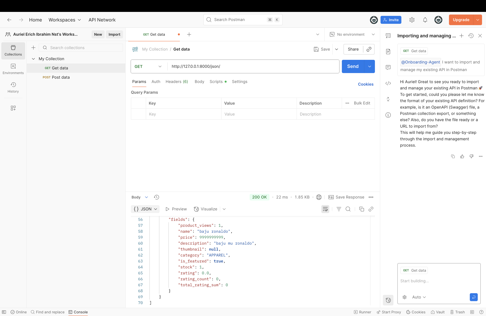
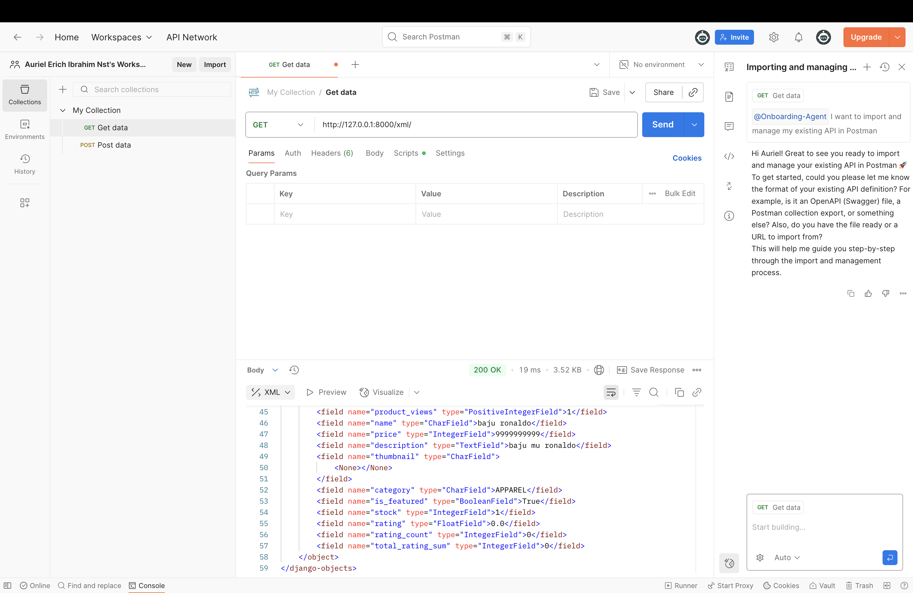
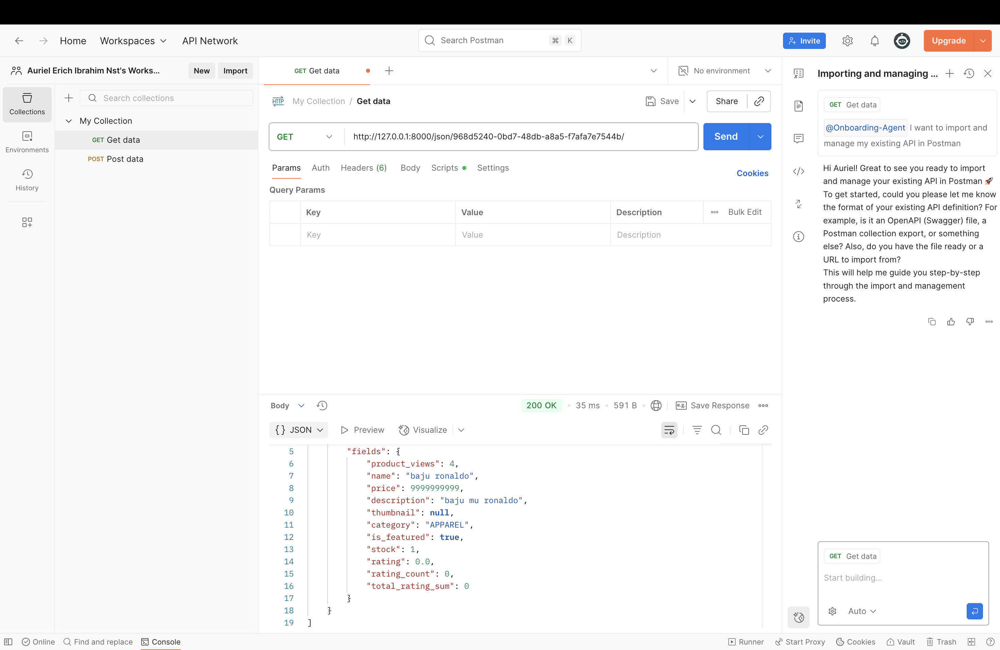
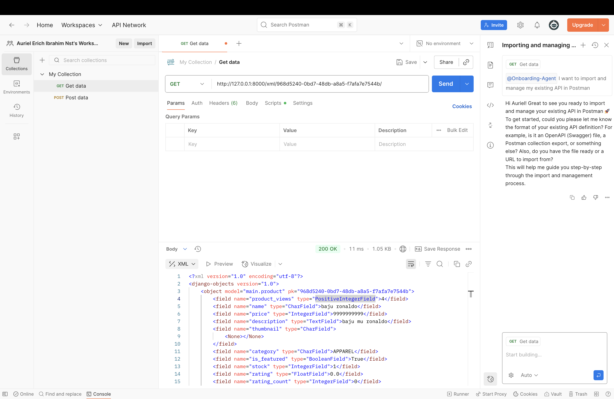

### 1. Jelaskan bagaimana cara kamu mengimplementasikan checklist di atas secara step-by-step (bukan hanya sekadar mengikuti tutorial).
step by step yang saya lakukan adalah seagai berikut:
1. buat repo baru digithub
2. membuat virtual environment dan mengaktifkanya
3. membuat file requirements.txt yang berisi dependencies
4. menginstal dependescies yang ada di requirements.txt dengan menjalankan comand
5. mengubah variabel environment dengan membuat file .env dan .env.prod
6. membuat file .gitignore untuk menjaga kerahasiaan data
7. membuat proyek django dengan nama richshop
8. membuat project baru di PWS dan menyamakan environs PWS dengan yang ada di .env.prod
9. mengkonfigurasi variabel environment dengan membuat file .env dan .env.prod
10. membuat aplikasi main didalam proyek
11. mendaftarkan aplikasi main kedalam variable INSTALLED_APPS pada file settings.py
12. membuat template yang berisikan main.html
13. Melengkapi logic pada file models.py,views.py, dan urls.py
14. setelah selesai lakukan migrasi
15. melakukan push ke github dengan git add, commit, push di github dan pws

### 2. Buatlah bagan yang berisi request client ke web aplikasi berbasis Django beserta responnya dan jelaskan pada bagan tersebut kaitan antara urls.py, views.py, models.py, dan berkas html.

Alur sederhana request dan response pada web aplikasi Django:

sumber: Forum Diskusi Minggu Kedua - "Alur Django" - Course PBP SCELE

Penjelasan keterkaitan berkas:

urls.py berfungsi sebagai “peta jalan”. Request yang masuk dari client akan diarahkan ke fungsi atau class pada views.py.

views.py berisi logika utama. Ia menerima request, bisa memanggil data dari models.py, lalu meneruskan data tersebut ke template HTML.

models.py menjadi representasi struktur data dalam database. Jika views.py membutuhkan data, ia akan mengakses database melalui models.py.

HTML template adalah tampilan yang diberikan kembali ke client. Data yang diproses di views.py akan dirender ke file HTML.

### 3. Jelaskan peran settings.py dalam proyek Django!

File settings.py memuat seluruh konfigurasi proyek Django, mulai dari koneksi database, daftar aplikasi yang digunakan, middleware, pengaturan keamanan, hingga konfigurasi static file. Dengan adanya file ini, proyek Django dapat dijalankan sesuai dengan environment yang diinginkan tanpa perlu menulis konfigurasi berulang kali.

### 4. Bagaimana cara kerja migrasi database di Django?

Migrasi di Django digunakan untuk menyelaraskan perubahan pada models.py dengan struktur tabel di database. Prosesnya:

Menulis atau mengubah model di models.py.

Menjalankan perintah python manage.py makemigrations untuk membuat berkas migrasi.

Menjalankan python manage.py migrate untuk menerapkan perubahan ke database.

Dengan migrasi, perubahan struktur tabel dapat dikelola secara teratur tanpa harus menulis query SQL manual.

### 5.  Menurut, dari semua framework yang ada, mengapa framework Django dijadikan permulaan pembelajaran pengembangan perangkat lunak?

Django dipilih sebagai framework awal pembelajaran karena sifatnya yang “batteries included”. Django menyediakan banyak fitur bawaan seperti sistem autentikasi, ORM, admin panel, serta arsitektur yang terstruktur. Dengan demikian, pemula dapat fokus memahami alur dasar pengembangan perangkat lunak berbasis web tanpa harus menambahkan terlalu banyak library eksternal.

### 6. Feedback untuk Asisten Dosen Tutorial 1

Tutorial 1 sudah cukup jelas dalam menjelaskan konsep dasar Django, terutama dalam pembuatan proyek dan aplikasi. Penjelasan langkah demi langkah membantu pemahaman peserta. Ke depannya, akan lebih baik jika diberikan contoh konkret bagaimana setiap file (urls.py, views.py, models.py) saling terhubung dalam membentuk sebuah alur request–response yang utuh.

### Tugas 2 README

## 1. Jelaskan mengapa kita memerlukan data delivery dalam pengimplementasian sebuah platform?

Jelas penting karena Data Delivery berperan agar komponen sistem dapat berkomunikasi dan bertukar informasi, 
Frontend perlu meminta data dari backend untuk mengembangkan sebuah Platform yang bagus. data delivery adalah cara yang digunakan agar keduanya bisa berkomunikasi, dimana backend fokus pada pengelolaan data untuk di delivery ke frontend, dan frontend fokus pada pengembangan platform dengan menggunakan format data yang diberikan backend

## 2.  Menurutmu, mana yang lebih baik antara XML dan JSON? Mengapa JSON lebih populer dibandingkan XML?

JSON dan XML memiliki kelebihan dan kekurangan masing masing, walaupun XML memiliki beberapa fitur lebih canggih, tetapi JSON lebih populer dibandingkan dengan XML karena format penulisan JSON lebih ringkas dan ringan, lebih mudah untuk dilihat dan dipahami, serta yang terpenting bersinergi dengan JavaScript.

## 3. Jelaskan fungsi dari method is_valid() pada form Django dan mengapa kita membutuhkan method tersebut?

is_valid() digunakan untuk melihat apakah form yang dikirim oleh user sudah valid atau belum, dengan mempertimbangkan seperti apakah field yang wajib di isi sudah di isi?, apakah tipe datanya benar? dan masih banyak lagi, jika semuanya benar maka akan bernilai true, tetapi jika error atau ada kesalahan maka akan disimpan errornya dan mengeluarkan False, salah satu penggunannya adalah di 

def create_product(request):
    form = ProductForm(request.POST or None)

    if form.is_valid() and request.method == "POST":
        form.save()
        return redirect('main:show_main')

    context = {'form': form}
    return render(request, "create_product.html", context)

disini jika data form itu is_valid() bernilai true dan request.method == "POST" baru lah form akan di save dan kita kembali ke show_main, tetapi ketika form itu is_valid() bernilai False atau request.method != "POST" 
maka akan mereturn render(request, "create_product.html", context)

## 4. Mengapa kita membutuhkan csrf_token saat membuat form di Django? Apa yang dapat terjadi jika kita tidak menambahkan csrf_token pada form Django? Bagaimana hal tersebut dapat dimanfaatkan oleh penyerang?

Kita membutuhkan csrf_token untuk mencegah serangan Cross-Site Request Forgery (CSRF). Tanpa token ini, sebuah situs jahat dapat menipu browser untuk mengirim perintah palsu seperti mengubah password atau membuat postingan ke situs lain di mana sedang login, server akan salah mengira permintaan palsu tersebut sebagai permintaan yang sah.csrf_token bekerja seperti password rahasia yang unik untuk setiap form. Saat form dikirim, server django akan memeriksa apakah password cocok. Karena situs jahat tidak mengetahui passwordnya, permintaan palsu dari mereka akan langsung ditolak

## 5. Jelaskan bagaimana cara kamu mengimplementasikan checklist di atas secara step-by-step (bukan hanya sekadar mengikuti tutorial).

pertama saya mulai dari membuat fungsi show_json, show_xml, show_json_by_id, show_xml_by_id menyesuaikan dengan apa yang sudah saya pelajari di tutorial 2 dan memasukkan path urlnya kedalam urls.py pada folder main

kedua saya membuat template di folder utama di isi dengan base.html sebagai template pada html lainnya, dan menambahkannya pada settings.py

ketiga saya mulai membuat dan merapikan models saya serta menambahkan beberapa function di models untuk di gunakan nnatinya

ke empat saya juga membuat function tambahan pada views untuk di gunakan nantinya yaitu create_produt (fungsi untuk membuat dan menambahkan produk) dan show_product untuk melihat detail dari produk

ke lima saya menambahkann path urlnya lagi kedalam urls.py pada folder main

ke enam saya mulai membuat template html berdasarkan function function yang baru saya buat di views.py agar 

ke tujuh saya mengecek kembali apakah ada url path yang belum di tambahkan, apakah ada pada settings.py yang perlu di perbaiki lagi (disini saya menambahkan token CSRF pada settings.py dan masih banyak lagi)

## 6. Apakah ada feedback untuk asdos di tutorial 2 yang sudah kalian kerjakan?

sangat ramah dan membantu saya ketika ada masalah serta menyampaikan informasi dengan sangat jelas (makasih banh)

## 7. Mengakses keempat URL di poin 2 menggunakan Postman, membuat screenshot dari hasil akses URL pada Postman, dan menambahkannya ke dalam README.md.

(http://127.0.0.1:8000/json/)

(http://127.0.0.1:8000/xml/)

(http://127.0.0.1:8000/json/968d5240-0bd7-48db-a8a5-f7afa7e7544b/)

(http://127.0.0.1:8000/xml/968d5240-0bd7-48db-a8a5-f7afa7e7544b/)

### Tugas 4
### 1. django authenticationform
django `AuthenticationForm` adalah form bawaan yang siap pakai untuk proses login pengguna, kelebihannya adalah sudah aman dan terintegrasi langsung dengan sistem otentikasi django, namun kekurangannya adalah kurang fleksibel jika ingin melakukan login menggunakan email secara default, karena terikat pada otentikasi dengan username

### 2. perbedaan autentikasi dan otorisasi
autentikasi adalah proses verifikasi identitas untuk menjawab "siapa anda?", sementara otorisasi adalah proses pengecekan hak akses untuk menjawab "apa yang boleh anda lakukan?", django mengimplementasikan autentikasi melalui sistem `User` dan login, sedangkan otorisasi diimplementasikan melalui *permission framework* bawaan yang menentukan hak akses pengguna terhadap data dan fitur

---
### 3. kelebihan dan kekurangan session dan cookies
perbedaan utama antara keduanya adalah tempat penyimpanan data; *cookies* menyimpan data di browser klien, sedangkan *session* menyimpan data di server dan hanya menempatkan id penanda di *cookie* klien, akibatnya, *cookies* lebih ringan bagi server namun kurang aman dan ukurannya terbatas, sementara *session* jauh lebih aman dan bisa menyimpan data lebih besar, namun lebih membebani server

---
### 4. keamanan cookies dan penanganan oleh django
secara default, *cookies* tidak aman dan rentan terhadap serangan seperti XSS dan CSRF, django menangani risiko ini dengan sangat baik dengan cara menerapkan *cookie* `HttpOnly` untuk mencegah akses dari javascript, flag `Secure` untuk memastikan transmisi hanya melalui HTTPS, serta menggunakan `csrf_token` yang kuat untuk memvalidasi asal dari setiap permintaan yang mengubah data

---
### 5. implementasi checklist secara step-by-step
### 1. memperbarui struktur data dengan relasi pengguna
langkah pertama adalah memodifikasi model `Product` di `models.py` dengan mengimpor `User` dan menambahkan *field* `ForeignKey` ke `User`, ini dilakukan untuk menautkan setiap produk ke seorang pengguna dan akan menghapus produk terkait jika pengguna dihapus (`on_delete=models.CASCADE`)

---
### 2. sinkronisasi database dengan model baru
setelah model diubah, struktur database disinkronkan dengan menjalankan perintah `migrate`, django akan otomatis menerapkan perubahan pada model `Product` dengan menambahkan kolom `user_id` ke tabel database

---
### 3. membangun fungsionalitas registrasi dan sesi pengguna
di `views.py`, fungsionalitas otentikasi dibangun dengan mengimpor `UserCreationForm`, `AuthenticationForm`, serta fungsi seperti `authenticate`, `login`, dan `logout`, selanjutnya, fungsi `register`, `login_user`, dan `logout_user` diimplementasikan untuk menangani pendaftaran dan manajemen sesi pengguna, termasuk validasi dengan `form.is_valid()`

---
### 4. mengamankan halaman khusus pengguna
untuk melindungi halaman tertentu, *decorator* `@login_required` diterapkan pada *view* `show_main` dan `show_product`, ini memastikan hanya pengguna yang sudah login yang dapat mengakses halaman tersebut dan akan mengalihkan pengguna anonim ke halaman login

---
### 5. menyimpan dan mempublikasikan perubahan
setelah semua fitur selesai dan diuji lokal, kode disimpan menggunakan Git dan diunggah dengan `push` ke repository GitHub, selanjutnya, perubahan yang sama juga di-*push* ke pws agar fungsionalitas baru dapat diakses secara online

### Tugas 5

### 1. urutan prioritas css selector
jika beberapa selector CSS menargetkan elemen html yang sama, prioritasnya ditentukan oleh **spesifisitas**, urutan dari yang tertinggi adalah *inline style*, diikuti oleh selektor id, kemudian selektor *class* atau atribut, dan yang terendah adalah selektor tipe elemen, aturan `!important` akan menimpa semua prioritas ini

---
### 2. mengapa responsive design menjadi konsep yang penting
**responsive design** adalah konsep penting agar website dapat beradaptasi dengan berbagai ukuran layar, dari desktop hingga ponsel, ini penting karena keberagaman perangkat saat ini dan tanpanya, pengguna ponsel akan mendapat pengalaman yang buruk, contoh situs responsif adalah tokopedia yang tata letaknya berubah di ponsel, sementara situs lama yang tidak responsif akan terlihat sangat kecil dan sulit dibaca

---
### 3. jelaskan perbedaan antara margin, border, dan padding
**margin**, **border**, dan **padding** adalah komponen dari css box model, **padding** adalah ruang di dalam elemen antara konten dan border, **border** adalah garis yang mengelilingi elemen, dan **margin** adalah ruang di luar elemen yang menciptakan jarak dengan elemen lain, ketiganya dapat diimplementasikan dalam css seperti ini: `.box { margin: 20px; border: 1px solid black; padding: 10px; }`

---
### 4. jelaskan konsep flex box dan grid layout
**flexbox** dan **grid** adalah sistem layout modern di CSS, **flexbox** adalah sistem *satu dimensi* yang ideal untuk mengatur item dalam satu baris atau satu kolom, seperti pada menu navigasi, sementara itu, **grid** adalah sistem *dua dimensi* yang sempurna untuk membuat tata letak halaman yang kompleks dengan baris dan kolom secara bersamaan, seperti galeri foto atau struktur utama halaman

## step by step

1.  **Modularisasi:** Logika buat nampilin satu produk dipisah dari `main.html` ke file komponen sendiri, `card_product.html`. Jadi kodenya lebih rapih, gampang diatur, dan komponen kartunya bisa dipakai ulang di bagian lain.  

2.  **Desain Visual yang Informatif:** Kartu produk ditambahin *badge* warna yang ditempel di atas gambar. Dipakai buat nampilin info singkat kayak **Kategori**, status **"Featured"**, atau **"Hot"** tanpa makan banyak tempat.  

3.  **Otorisasi di Template:** Logika otorisasi langsung ditaruh di template dengan ``. Jadi tombol **"Edit"** sama **"Delete"** cuma muncul kalau user yang login memang pemilik produk. Lebih aman dan enak dipakai.  

4.  **Konsistensi Tampilan:** Biar grid tetap rapih, dipakai kelas `line-clamp` dan filter `truncatewords` di judul sama deskripsi. Hasilnya semua kartu punya tinggi seragam dan kelihatan lebih profesional meskipun kontennya panjang.  

## Implementasi Upload Thumbnail

Thumbnail produk sekarang bukan lagi input URL, tapi udah bisa *upload* gambar langsung. Perubahannya:  

1.  **Model:** Di `models.py`, field `thumbnail` diganti dari `URLField` jadi `ImageField`. Butuh install *library* `Pillow` biar backend bisa proses gambar.  

2.  **Konfigurasi Project:** Di `settings.py` ditambah `MEDIA_ROOT` buat nyimpen file upload, dan `MEDIA_URL` buat akses file itu lewat URL.  

3.  **URL Project:** `urls.py` utama diupdate supaya file media bisa ditampilkan pas mode dev (`DEBUG=True`).  

4.  **Form & View:**
    * Form di `create_product.html` sama `edit_product.html` ditambah `enctype="multipart/form-data"`.  
    * View yang handle form juga diupdate biar bisa baca `request.FILES`.  

5.  **Template Tampilan:**
    * Semua tag `` yang dulu pakai `{{ product.thumbnail }}` diganti jadi `{{ product.thumbnail.url }}`.  
    * Kalau produk nggak punya gambar, otomatis muncul *placeholder* (`no-product.png`) dari folder *static*.  

6.  **Migrasi Database:** Jangan lupa jalanin `makemigrations` sama `migrate` buat nyesuaiin struktur database.  